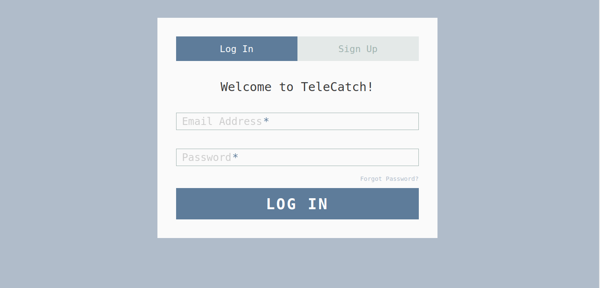
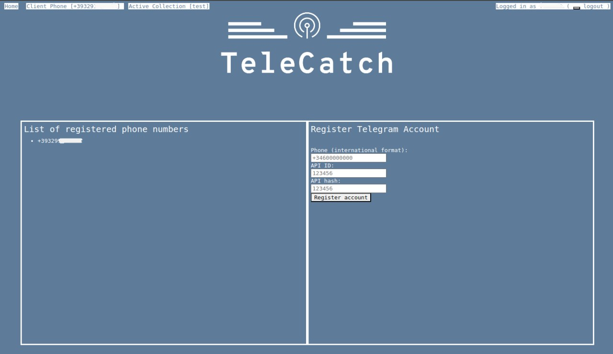
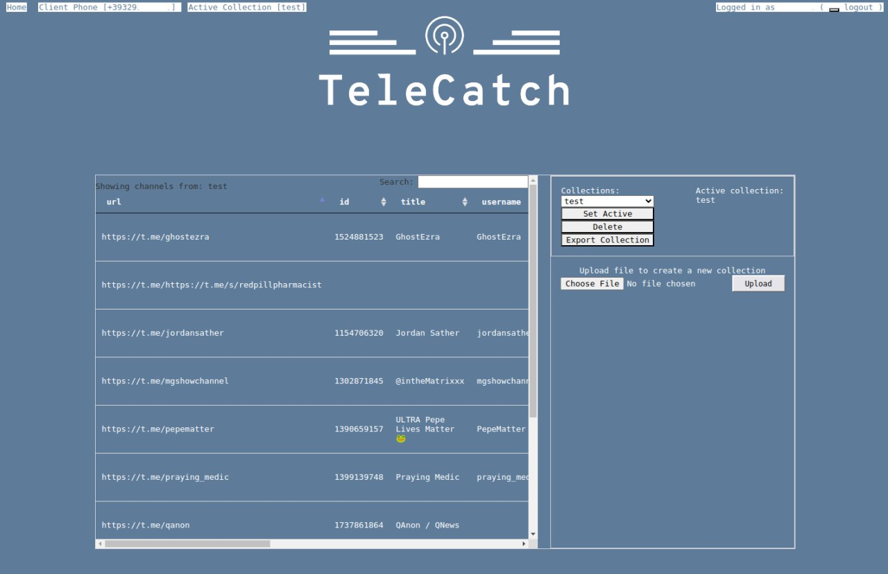
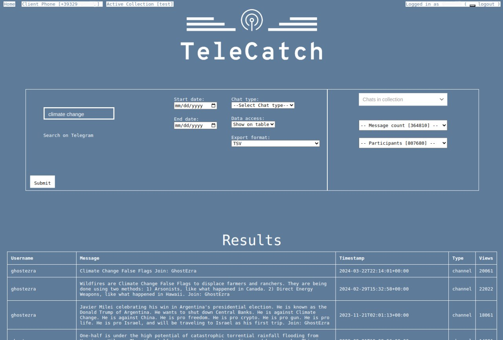

# TeleCatch


TeleCatch is a comprehensive web application that provides a web-based interface and a REST api for managing and analyzing [Telegram](https://telegram.org/) data.
With a secure and user-friendly dashboard, users can manage Telegram accounts, configure data collections, and access insightful visualizations directly from their browser.

It is based on [Telethon](https://github.com/LonamiWebs/Telethon), to interact with Telegram APIs, and [FastAPI](https://github.com/fastapi/fastapi) for API and UI development.

TeleCatch has the following key features:
- management of custom collection of Telegram groups and channels
- management of multiple Telegram accounts
- download of messages and/or images from Telegram directly to local clients (streaming, no need to store data on the server first)
- quick visualization of samples


## Installation

### Local deployment
To install and set up TeleCatch, follow the steps below. This project requires Python 3.10 or above, environment variables for configuration, and optionally, Docker for containerized deployment.

1. Clone the Repository
First, clone the repository locally:

``` bash
git clone https://github.com/labaffa/telecatch.git
cd telecatch
```

2. Install Dependencies

From inside repo folder, via pip:

``` bash
pip install -r requirements.txt
```

3. Set Up Environment Variables
TeleCatch requires several environment variables to configure encryption and email functionality. You can add these variables in a .env file in the project root.

Required Variables:

```env
JWT_SECRET_KE: Hex key (32-bit) used for jwt signature.
JWT_REFRESH_SECRET_KE: Hex key (32-bit) for refresh jwt signature.
DATA_SECRET_KEY: Hex key (16-bit) for user data encryption
MAIL_USERNAME: The email address for sending verification and reset emails.
MAIL_PASSWORD: Password for the email account.
```

To create a 32-bit and a 16-bit hex key, you can use the openssl command to generate random data:

- 32-bit hex key (for JWT_SECRET_KEY and JWT_REFRESH_SECRET_KEY):
  ```bash
  openssl rand -hex 32  # Generates a 64-character hex key (32 bytes)
  ```
- 16-bit hex key (for DATA_SECRET_KEY):
  ```bash
  openssl rand -hex 16  # Generates a 32-character hex key (16 bytes)
  ```
4. Run Database Migrations
Before starting the server, ensure the database schema is up-to-date by running Alembic migrations:

```bash
alembic upgrade head
```

5. Run TeleCatch
Start the server by running:

```bash
uvicorn telecatch.main:app
```

The app will be accessible at `http://127.0.0.1:8000`.

### Using Docker
If you prefer to run TeleCatch in a Docker container, follow these steps with [docker installed](https://docs.docker.com/engine/install/) :

Build the Docker image:


```bash

docker build -t telecatch .
```


Create a `.env` file containing all the required variables above mentioned and run the Docker container:


```bash
docker run --env-file .env -p 8000:8000 telecatch
```


With the previous command, app's data (users, Telegram clients info, metadata, etc.) stay at *container's level*, which means that any new `docker run` loses track of all the data.  
To make data persistent across different *containers*, a local folder of the host machine can be [mounted](https://docs.docker.com/engine/storage/bind-mounts/). 

The new command will be then:
```bash
docker run --env-file .env --mount type=bind,source=/absolute/host/path/for/app/data,target=/app/teledash/sessions -p 8000:8000 telecatch
```
The app will be accessible at `http://0.0.0.0:8000`.


## Usage

### Web interface

The web interface allows users to manage and query their Telegram data through a user-friendly dashboard. Here’s a step-by-step guide on how to get started:
1. Registration and Login
   
    <p align="center"></p>
    
   - When first using TeleCatch on your browser, you will be redirected to `http://127.0.0.1:8000/app_login`
   - Go to `Sign Up` tab and fill in the registration form with a valid email, username and password.
   - If the message for a correct registration is shown, move to `Log In` tab and log in with your credentials.

3. Telegram Authentication

   <p align="center"></p>
    
   - The authentication process can be done from the `http://127.0.0.1:8000/clients` view, or clicking `Client phone` from the navbar on top.
   - Before being able to authenticate and create a Telegram client, you must have or get your own api_id and api_hash following [Telegram instructions](https://my.telegram.org).
   - After you click on "Register account", wait for a code Telegram will send on your app and insert it. Authentication should be complete.
   - IMPORTANT: disable 2factor authentication from your Telegram app's settings before authentication.

4. Create a collection of groups and channels

   <p align="center"></p>
    
   - go to `http://127.0.0.1:8000/clients` or click  `Active collection` on the navbar
   - click `Choose file` to upload a csv-like file (.xls, .xlsx, .csv, .tsv) containing the identifiers of the groups and channels of the new collection. A mandatory `url` column must be present: this is the place for urls and/or usernames of groups and channels. Other optional columns are considered: language, location, category
   - upload the file, choose a title for the collection and save it.
  
6. Querying Data:

   <p align="center"></p>

   - go to the home `http://127.0.0.1:8000/` or click `Home` on the navbar. Use the search bar to query messages within your collections
   - you can filter by dates, group or channel, type of data access (show a sample on the `Results` table or export and download all the messages and images to a tsv file)

### REST API

This section demonstrates how to interact with the TeleCatch REST API using Python.  
The examples show steps for registering, authenticating, and performing basic operations within TeleCatch.  
While Python is used here for demonstration purposes, the API can be accessed through any HTTP client or programming language capable of making HTTP requests.

1. **Register a New User**
   
   To begin, create a new user by sending a POST request to the `/api/v1/auth/register` endpoint with the required user information.

    ```python
    import requests
    
    domain = "httop://0.0.0.0:8000"   
    email = "test@example.com"
    username = "test_user"
    password = "test_password"
    
    data = {
        "email": email,
        "username": username,
        "password": password
    }
    
    session = requests.Session()
    response = session.post(f"{domain}/api/v1/auth/register", json=data)
    ```

2. **Log In**
   
   Log in with the newly created user credentials by sending a POST request to `/api/v1/auth/login`.
   Upon success, an access token is returned and used for all subsequent requests (authentication via cookie transport is also available via `/api/v1/cookie/login`)

    ```python
    login_data = {
        "username": email,
        "password": password
    }
    
    response = session.post(f"{domain}/api/v1/auth/login", data=login_data)
    token = response.json().get("access_token")
    
    # Set the token in the session headers
    session.headers.update({
        "Authorization": f"Bearer {token}"
    })
    ```

3. **Register a Telegram Client**
   
   To connect a Telegram client, send a POST request to `/api/v1/clients/register` with the client’s phone number (or bot token), API ID, and API hash.

    ```python
    client_data = {
        "phone_or_bot_token": "+34123456789",
        "api_id": "123456",
        "api_hash": "f35bd22ef3a1ffd31e1263e8555e39f1"
    }
    
    response = session.post(f"{domain}/api/v1/clients/register", data=client_data)
    ```
  
    If everything goes well, you will receive a log in code from Telegram on your clients (phone, desktop or web app).  
    Once you have received, it can be used to complete the authentication process:
    
    ```python
    client_data["code"] = 12345
    response = session.post(f"{domain}/api/v1/clients/register", data=client_data)
    ```

4. **Set the Client as Active**
   
   Retrieve the list of registered clients, then set one as active by passing the client_id in a request to `/api/v1/clients/set_active`.
   
    ```python
    # Get list of registered clients
    response = session.get(f"{domain}/api/v1/clients/registered")
    client_id = response.json()[0]["client_id"]
    
    # Set the client as active
    response = session.post(f"{domain}/api/v1/clients/set_active?client_id={client_id}")
    ```


5. **Upload a Collection**
   
   To upload a collection file for analysis, use the `/api/v1/collections/item/{title}/from_file` endpoint.
   Send a file in TSV format for parsing, replacing {title} with a descriptive title for the collection.

    ```python
    file_path = "/path/to/your/collection_test.tsv"
    collection_data = {
        "file": open(file_path, "rb")
    }
    title = "sample_collection"
    response = session.post(f"{domain}/api/v1/collections/item/{title}/from_file", files=collection_data)

    ```

7. **Search the Collection**
   
   Perform a search within the uploaded collections by sending a GET request to `/api/v1/search`.
   Use query parameters to specify search criteria, such as q for the search term, source for the collection, and source_type for the data source.
   
     ```python
     from urllib.parse import urlencode
  
      params = {
          "q": "climate change",
          "source": "sample_collection",
          "source_type": "collection"
      }
      
      query_string = urlencode(params)
      response = session.get(f"http://example.com/api/v1/search?{query_string}")
  
     ```

## Authors and acknowledgment


TeleCatch was developed with support from the CGIAR Initiative on Fragility, Conflict, and Migration and the CGIAR Initiative on Climate Resilience, ClimBeR. We would like to thank all funders who supported this research through their contributions to the [CGIAR Trust Fund](https://www.cgiar.org/funders/).


## License

