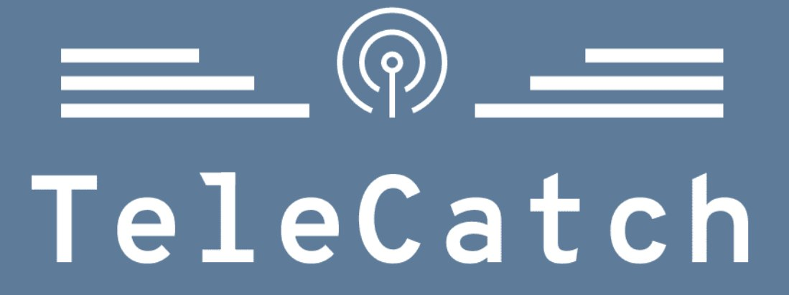

# TeleCatch

TeleCatch is a comprehensive web application that provides a web-based interface and a REST api for managing and analyzing [Telegram](https://telegram.org/) data.
With a secure and user-friendly dashboard, users can manage Telegram accounts, configure data collections, and access insightful visualizations directly from their browser.

It is based on [Telethon](https://github.com/LonamiWebs/Telethon), to interact with Telegram APIs, and [FastAPI](https://github.com/fastapi/fastapi) for API and UI development.

TeleCatch has the following key features:
- management of custom collection of Telegram groups and channels
- management of multiple Telegram accounts
- download of messages and/or images from Telegram directly to local clients (streaming, no need to store data on the server first)
- quick visualization of samples

## Installation

## Usage

## Authors and acknowledgment

## License

